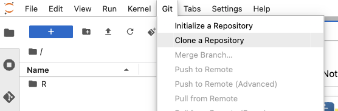
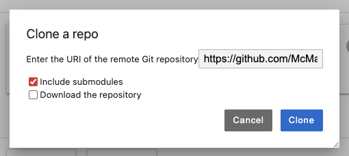
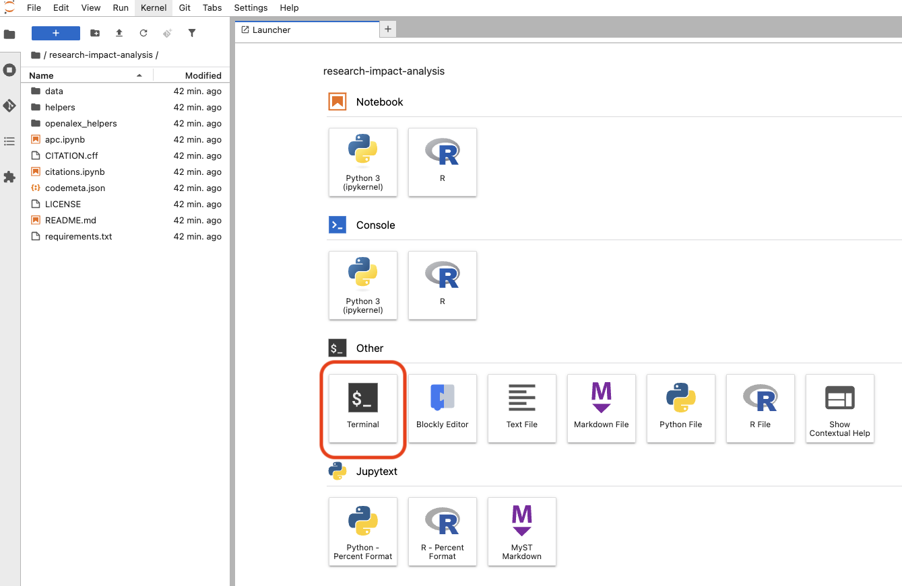
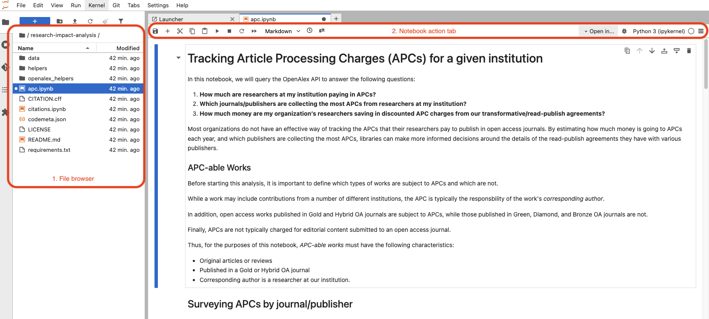

# Syzygy

The following instruction is to run the notebooks on Syzygy.  

Syzygy is a JupyterHub instance hosted by Pacific Institute for the Mathematical Sciences, Digital Research Alliance of Canada and Cybera to bring JupyterLab to researchers across Canada. Log in using your Canadian university or college credentials via the Canadian Access Federation (CAF). If you're not affiliated with a CAF institution, you may not be able to use Syzygy.  

## Clone The Repository

Select "Git" under the tab menu and choose the "Clone a repository" option. Enter the URL of this repository, [`https://github.com/McMasterRS/research-impact-analysis.git`](https://github.com/McMasterRS/research-impact-analysis.git), and click "Clone". This will create a copy of the repository in your Syzygy home directory.  





## Install Dependencies (Optional)

The notebooks use the following Python packages that are not pre-installed in Syzygy. You can install them using pip in a terminal. Open a terminal by selecting "Terminal" under the tab menu and choosing "New Terminal". Then, run the following command in the terminal:  

```bash
pip install -r requirements.txt
```



## Run Notebooks

Select the notebook (`.ipynb`) file you want to run from the file browser on the left side of the interface. Click on the notebook file to open it.  



Select the play button from the notebook action tab to execute the cells in the notebook. 
